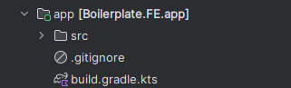
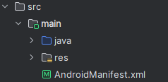
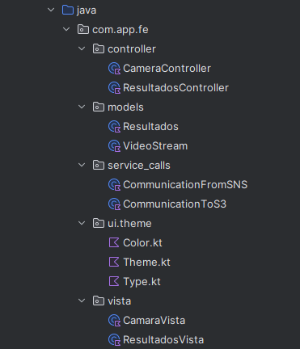

# Descripción del Boilerplate

Acá, tenemos una descripción completa de cada uno de los folders a usar dentro del proyecto, así como su utilidad, hay que tomar
en consideración que algunos fueron generados de forma automática por la creación del proyecto y no fueron quitados por su
utilidad.

## Sección Root
Acá incluiremos todo lo ubicado en el folder Root, o FE/, todos los documentos a tomar en consideración

* **gradle/**: Contiene archivos del wrapper de Gradle, como `gradle-wrapper.jar` y `gradle-wrapper.properties`, los
cuales permiten usar una versión específica de Gradle sin necesidad de instalarla globalmente en cada máquina.
* **docs/**: Folder que contiene fotos de la documentación tomada y usada en documentación.
* **.gitignore**: Archivo encargado de ignorar ciertas partes del proyecto, para evitar subir archivos innecesarios al repositorio.
* **build.gradle.kts**: Contiene la configuración build de Gradle, incluyendo las dependencias del programa.
* **settings.gradle.kts**: Especifica configuraciones del proyecto.
* **gradlew** y **gradlew.bat**: Scripts para ejecutar Gradle utilizando el wrapper, permitiendo que todos los desarrolladores
  utilicen la misma versión de Gradle. `gradlew` es para sistemas Unix (Linux/macOS) y `gradlew.bat` es para Windows.
* **gradle.properties**: Define propiedades para la construcción del proyecto, como configuraciones de la JVM.
* **app**: Folder que contiene la información de la App, como la configuración individual del Gradle, y un gitIgnore propio

## Sección App
Parte más importante a tomar a consideración de la aplicación, ya que acá manejaremos los archivos de código fuente que se
encargan del funcionamiento del FrontEnd

* **src**: Source content, folder en el que tenemos el código fuente el proyecto.
* **.gitignore**: Git encargado de ignorar los folders de build que no son necesarios de tener en la app
* **build.gradle.kts**: A diferencia del existente en el Root, éste se encarga de setear la aplicación de modo que esté configurado
para un sistema operativo, configuraciones como la versión de compilador usado, configuración inicial, tipos de build requeridas,
características, y las dependencias que tendrá la app.

## Sección src/main (Source Code)
Acá directamente entramos con el source code, inicialmente tendría 3 archivos generados automáticamente, pero en éste caso usaremos
el folder main solamente (suele tener un test y AndroidTest generados automáticamente). Dentro en Main, se tiene la siguiente estructura:

* **res/**: Almacena todos los archivos de recursos a tomar en consideración, así como xml que contienen reglas de extracción y backup,
dibujables, iconos, y una sección de values default que funciona como una caja de Estilos default, práctica para el proyecto.
* **AndroidManifest.xml**: XML que contiene la información de arranque de la aplicación dentro de Android, acá también se maneja las
distintas pantallas a las que se puede hacer routing, como el definir la pantalla inicial, también se utilizan varios recursos como si
tiene el backup, el nombre que va a tener la aplicación, el ícono de ésta, y más detalles a tomar en consideración al generar el producto
final.
* **java/**: Éste folder... aunque trabajamos en Kotlin, contiene todo lo necesario para trabajar y controlar los archivos source del proyecto, acá manejamos
el paquete del proyecto con las vistas, controladores y modelos, así como decoración del UI

## Sección Java (Distribución de la aplicación)
Dentro tenemos al paquete com.app.fe, dentro de éste, tenemos las distintas distribuciones a tomar en consideración

* **controller/**: Controladores de la aplicación
  * CameraController: Controlador que maneja extracción de la cámara y comunicación con el servicio de Comunicación al S3
  * ResultadosController: Controlador de la página de resultados que maneja los datos recibidos por la conexión al SNS
* **models/**: Acá manejamos el modelo de VideoStream, el video generado por la cámara, y el modelo de Resultados como tal.
  * VideoStream: Modelo que contiene un ID de identificación para enviar del vídeo, y el vídeo como tal generado
  * Resultados: Modelo como tal que recibe un JSON o diccionario con los datos específicos a mostrar
* **vista/**: Acá tenemos la parte gráfica de la aplicación como tal, las pantallas y sus funciones gráficas.
  * CamaraVista: Vista concentrada en el escaneo de un vídeo, con base a dicho vídeo, se generarán los resultados deseados
  * ResultadosVista: Pantalla encargada de mostrar los datos previamente escaneados y recibidos en el controlador.
* **service/calls**: Acá tenemos la parte encargada de ejecutar el formato ambassador o permitir la comunicación al backend para extracción de datos:
  * CommunicationToS3: Hook que recibe un VideoStream objeto, con la ID usada para enviar la información por S3 con identificador, y enviar al Backend.
  * CommunicationFromSNS: Sistema encargado de retornar un Json o un archivo con los datos específicos y enviar al controlador de Resultados.
* **ui.theme/**: Contiene un Theme, Type y Color, y en resumen, se encarga de definir el diseño por default de las pantallas.
