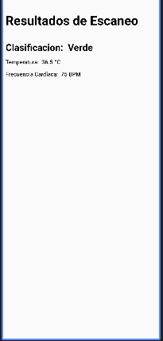

# Diseño del Frontend
## Tabla contenidos

- [Sección de UI](#ui)
- [Sección de Capas y Modelos](#diagrama-de-capas-y-clases)
- [Sección de Boilerplate](#boilerplate)

## UI

### Pantallas manejadas
Dado que aún estan en progreso, acá las páginas base, hechas en la aplicación, usando nuestro lenguaje de Kotlin.

#### 1. Pantalla Escaneo:

**Descripción:**
- **Estado Inicial:** Muestra la vista de la cámara con un borde que refleja los puntos de enfoque de la calibración. El botón circular al final permite inicial el escaneo.
- **Acciones:**
  - **Iniciar Escaneo:** Al presionar el botón, se activa el estado de escaneo y se muestra un texto "Scanning...". Cuando el proceso de escaneo termina, se navega automáticamente a la pantalla de resultados.
- **Mensajes:**
  - **En Escaneo:** "Scanning..." se muestra en la parte superior mientras el escaneo está en progreso.

#### 2. Pantalla Resultados:

**Descripción:**
- **Estado Inicial:** Muestra los resultados del escaneo con un título y una lista de valores.
- **Acciones:**
  - **Visualización de Resultados:** Despliega la clasificación, temperatura, frecuencia cardíaca y otros datos relevantes recibidos del escaneo.
  - **Desplazamiento Vertical:** Permite al usuario desplazarse para ver todos los resultados disponibles.
- **Mensajes:**
  - **Datos de Resultados:** Cada dato relevante (por ejemplo, temperatura y frecuencia cardíaca) se muestra con un formato claro y legible.

### Matrix de Requerimientos funcionales vs componentes visuales

| **Requerimientos Funcionales**                           | **Componentes CamaraVista** | **Componentes Resultados Vista** |
|----------------------------------------------------------|-------------------------|----------------------------|
| Permitir el inicio de un escaneo                          | Botón de escaneo        | No aplica                  |
| Visualizar imagen de la persona siendo escaneada          | Imagen (persona)        | No aplica                  |
| Mostrar borde rojo durante el escaneo                     | Borde alrededor de la imagen | No aplica               |
| Cambiar a la vista de resultados tras el escaneo          | Lógica de navegación    | No aplica                  |
| Visualizar clasificación del escaneo                      | No aplica               | Texto (Clasificación)      |
| Visualizar temperatura corporal                           | No aplica               | Texto (Temperatura)        |
| Visualizar frecuencia cardíaca                            | No aplica               | Texto (Frecuencia Cardíaca)|
| Mostrar lista de resultados adicionales                   | No aplica               | LazyColumn (Resultados)    |
| Mostrar mensaje de "Scanning..." mientras se escanea      | Texto (Scanning...)     | No aplica                  |
| Diseño adaptativo para diferentes tamaños de pantalla     | Box, Column, Padding    | Box, Column, LazyColumn    |
| Botón para realizar una nueva acción o finalizar          | Botón de escaneo        | No aplica                  |

## Diagrama de capas y clases
Acá tenemos documentado nuestro diagrama de capas, el cual también unimos al de clases, usado para el desarrollo de la parte de la interfaz de la aplicación.

## Boilerplate
Acá, tenemos una descripción completa de cada uno de los folders a usar dentro del proyecto, así como su utilidad, hay que tomar en consideración que algunos fueron generados de forma automática por la creación del proyecto y no fueron quitados por su utilidad.

[Ver Documentación del Boilerplate](Boilerplate/FE/README.md)

