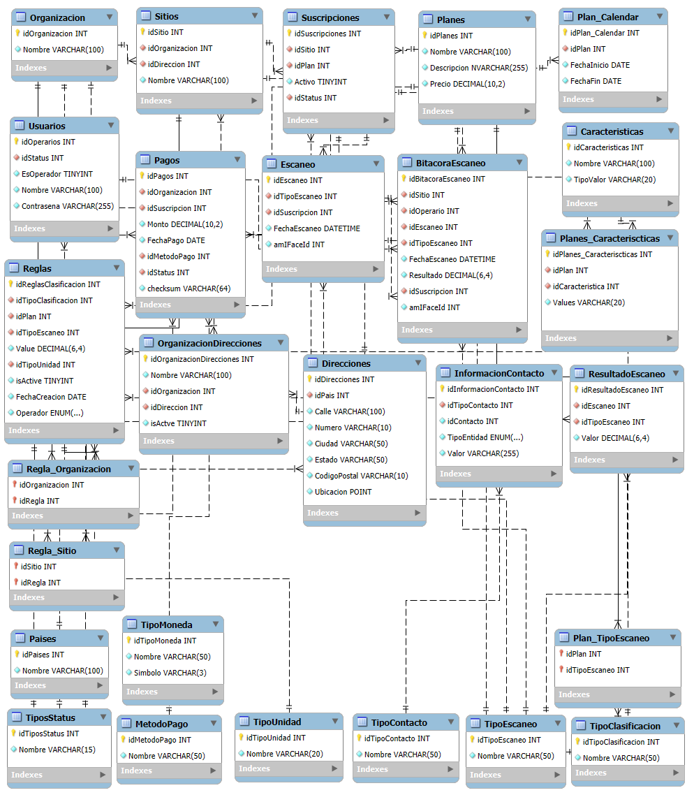

# Primera versión del desarrollo de las tablas

A continuación se añade una imagen de cada una de las tablas generadas y sus relaciones:

Ahora, considerando las tablas anteriores, se procederá a llenarlas con datos con el fin de ejemplificarlo:

Script de MySQL:

    CREATE DATABASE  IF NOT EXISTS `proyectov1` /*!40100 DEFAULT CHARACTER SET utf8mb3 */ /*!80016 DEFAULT ENCRYPTION='N' */;
    USE `proyectov1`;

    CREATE TABLE `bitacoraescaneo` (
    `idBitacoraEscaneo` int NOT NULL AUTO_INCREMENT,
    `Bitacora_idSitio` int NOT NULL,
    `Bitacora_idOperario` int NOT NULL,
    `Bitacora_idEscaneo` int NOT NULL,
    `Bitacora_idOperacion` int NOT NULL,
    `FechaEscaneo` datetime NOT NULL,
    `ResultadoAnterior` varchar(255) NOT NULL,
    `ResultadoNuevo` varchar(255) NOT NULL,
    PRIMARY KEY (`idBitacoraEscaneo`),
    KEY `idSitio_idx` (`Bitacora_idSitio`),
    KEY `idOperario_idx` (`Bitacora_idOperario`),
    KEY `idEscaneo_idx` (`Bitacora_idEscaneo`),
    KEY `idOperacion_idx` (`Bitacora_idOperacion`),
    CONSTRAINT `idEscaneo` FOREIGN KEY (`Bitacora_idEscaneo`) REFERENCES `escaneo` (`idEscaneo`),
    CONSTRAINT `idOperacion` FOREIGN KEY (`Bitacora_idOperacion`) REFERENCES `tipooperacion` (`idTipoOperacion`),
    CONSTRAINT `idOperario` FOREIGN KEY (`Bitacora_idOperario`) REFERENCES `operarios` (`idOperarios`),
    CONSTRAINT `idSitio` FOREIGN KEY (`Bitacora_idSitio`) REFERENCES `sitios` (`idSitio`)
    ) ENGINE=InnoDB DEFAULT CHARSET=utf8mb3;

    CREATE TABLE `escaneo` (
    `idEscaneo` int NOT NULL AUTO_INCREMENT,
    `Escaneo_idTipoEscaneo` int NOT NULL,
    `Escaneo_idSuscripcion` int NOT NULL,
    `FechaEscaneo` datetime NOT NULL,
    `Resultado` varchar(200) NOT NULL,
    `Escaneo_idStatus` int NOT NULL,
    PRIMARY KEY (`idEscaneo`),
    KEY `idTipoEscaneo_idx` (`Escaneo_idTipoEscaneo`),
    KEY `idSuscripcion_idx` (`Escaneo_idSuscripcion`),
    KEY `idStatus_idx` (`Escaneo_idStatus`),
    CONSTRAINT `idStatus` FOREIGN KEY (`Escaneo_idStatus`) REFERENCES `tiposstatus` (`idTiposStatus`),
    CONSTRAINT `idSuscripcion` FOREIGN KEY (`Escaneo_idSuscripcion`) REFERENCES `suscripciones` (`idSuscripciones`),
    CONSTRAINT `idTipoEscaneo` FOREIGN KEY (`Escaneo_idTipoEscaneo`) REFERENCES `tipoescaneo` (`idTipoEscaneo`)
    ) ENGINE=InnoDB DEFAULT CHARSET=utf8mb3;

    CREATE TABLE `metodopago` (
    `idMetodoPago` int NOT NULL AUTO_INCREMENT,
    `Nombre` varchar(45) NOT NULL,
    PRIMARY KEY (`idMetodoPago`)
    ) ENGINE=InnoDB DEFAULT CHARSET=utf8mb3;

    CREATE TABLE `operarios` (
    `idOperarios` int NOT NULL AUTO_INCREMENT,
    `Nombre` varchar(45) NOT NULL,
    `Telefono` int NOT NULL,
    `Correo` varchar(45) NOT NULL,
    `idStatus` int NOT NULL,
    PRIMARY KEY (`idOperarios`),
    KEY `idStatus_idx` (`idStatus`),
    CONSTRAINT `Operarios_idStatus` FOREIGN KEY (`idStatus`) REFERENCES `tiposstatus` (`idTiposStatus`)
    ) ENGINE=InnoDB DEFAULT CHARSET=utf8mb3;

    CREATE TABLE `organizacion` (
    `idOrganizacion` int NOT NULL AUTO_INCREMENT,
    `Nombre` varchar(45) NOT NULL,
    `Telefono` varchar(45) NOT NULL,
    `Correo` varchar(45) NOT NULL,
    `idPais` int NOT NULL,
    `Direccion` varchar(100) NOT NULL,
    PRIMARY KEY (`idOrganizacion`),
    KEY `idPais_idx` (`idPais`),
    CONSTRAINT `Organizacion_idPais` FOREIGN KEY (`idPais`) REFERENCES `paises` (`idPaises`)
    ) ENGINE=InnoDB DEFAULT CHARSET=utf8mb3;

    CREATE TABLE `pagos` (
    `idPagos` int NOT NULL AUTO_INCREMENT,
    `idOrganizacion` int NOT NULL,
    `idSuscripcion` int NOT NULL,
    `Monto` decimal(6,0) NOT NULL,
    `FechaPago` date NOT NULL,
    `idMetodoPago` int NOT NULL,
    `idStatus` int NOT NULL,
    PRIMARY KEY (`idPagos`),
    KEY `idOrganizacion_idx` (`idOrganizacion`),
    KEY `idSuscripcion_idx` (`idSuscripcion`),
    KEY `idMetodoPago_idx` (`idMetodoPago`),
    KEY `idStatus_idx` (`idStatus`),
    CONSTRAINT `Pagos_idMetodoPago` FOREIGN KEY (`idMetodoPago`) REFERENCES `metodopago` (`idMetodoPago`),
    CONSTRAINT `Pagos_idOrganizacion` FOREIGN KEY (`idOrganizacion`) REFERENCES `organizacion` (`idOrganizacion`),
    CONSTRAINT `Pagos_idStatus` FOREIGN KEY (`idStatus`) REFERENCES `tiposstatus` (`idTiposStatus`),
    CONSTRAINT `Pagos_idSuscripcion` FOREIGN KEY (`idSuscripcion`) REFERENCES `suscripciones` (`idSuscripciones`)
    ) ENGINE=InnoDB DEFAULT CHARSET=utf8mb3;

    CREATE TABLE `paises` (
    `idPaises` int NOT NULL,
    `Nombre` varchar(45) NOT NULL,
    PRIMARY KEY (`idPaises`)
    ) ENGINE=InnoDB DEFAULT CHARSET=utf8mb3;

    CREATE TABLE `plan_tipoescaneo` (
    `idPlan` int NOT NULL,
    `idTipoEscaneo` int NOT NULL,
    PRIMARY KEY (`idPlan`,`idTipoEscaneo`),
    KEY `idTipoEscaneo_idx` (`idTipoEscaneo`),
    CONSTRAINT `PlanTipoEscaneo_idPlan` FOREIGN KEY (`idPlan`) REFERENCES `planes` (`idPlanes`),
    CONSTRAINT `PlanTipoEscaneo_idTipoEscaneo` FOREIGN KEY (`idTipoEscaneo`) REFERENCES `escaneo` (`idEscaneo`)
    ) ENGINE=InnoDB DEFAULT CHARSET=utf8mb3;

    CREATE TABLE `planes` (
    `idPlanes` int NOT NULL AUTO_INCREMENT,
    `Nombre` varchar(45) NOT NULL,
    `Descripcion` varchar(45) NOT NULL,
    `Costo` decimal(6,0) NOT NULL,
    `FechaFin` date NOT NULL,
    `Disponibilidad` int NOT NULL,
    `CantidadEscaneos` int NOT NULL,
    PRIMARY KEY (`idPlanes`)
    ) ENGINE=InnoDB DEFAULT CHARSET=utf8mb3;

    CREATE TABLE `reglasclasificacion` (
    `idReglasClasificacion` int NOT NULL AUTO_INCREMENT,
    `idTipoClasificacion` int NOT NULL,
    `idPlan` int NOT NULL,
    `idTipoEscaneo` int NOT NULL,
    PRIMARY KEY (`idReglasClasificacion`),
    KEY `idTipoClasificacion_idx` (`idTipoClasificacion`),
    KEY `idPlan_idx` (`idPlan`),
    KEY `idTipoEscaneo_idx` (`idTipoEscaneo`),
    CONSTRAINT `Reglas_idPlan` FOREIGN KEY (`idPlan`) REFERENCES `planes` (`idPlanes`),
    CONSTRAINT `Reglas_idTipoClasificacion` FOREIGN KEY (`idTipoClasificacion`) REFERENCES `tipoclasificacion` (`idTipoClasificacion`),
    CONSTRAINT `Reglas_idTipoEscaneo` FOREIGN KEY (`idTipoEscaneo`) REFERENCES `tipoescaneo` (`idTipoEscaneo`)
    ) ENGINE=InnoDB DEFAULT CHARSET=utf8mb3;

    CREATE TABLE `sitios` (
    `idSitio` int NOT NULL AUTO_INCREMENT,
    `idOrganizacion` int NOT NULL,
    `idReglaClasificacion` int NOT NULL,
    `Nombre` varchar(45) NOT NULL,
    PRIMARY KEY (`idSitio`),
    KEY `idOrganizacion_idx` (`idOrganizacion`),
    KEY `idReglaClasificacion_idx` (`idReglaClasificacion`),
    CONSTRAINT `Sitio_idOrganizacion` FOREIGN KEY (`idOrganizacion`) REFERENCES `organizacion` (`idOrganizacion`),
    CONSTRAINT `Sitio_idReglaClasificacion` FOREIGN KEY (`idReglaClasificacion`) REFERENCES `reglasclasificacion` (`idReglasClasificacion`)
    ) ENGINE=InnoDB DEFAULT CHARSET=utf8mb3;

    CREATE TABLE `suscripciones` (
    `idSuscripciones` int NOT NULL AUTO_INCREMENT,
    `idPlan` int NOT NULL,
    `idSitio` int NOT NULL,
    `FechaInicio` date NOT NULL,
    `FechaRenovacion` date NOT NULL,
    `Activo` tinyint NOT NULL,
    `idStatus` int NOT NULL,
    PRIMARY KEY (`idSuscripciones`),
    KEY `idPlan_idx` (`idPlan`),
    KEY `idSitio_idx` (`idSitio`),
    KEY `idStatus_idx` (`idStatus`),
    CONSTRAINT `Suscripciones_idPlan` FOREIGN KEY (`idPlan`) REFERENCES `planes` (`idPlanes`),
    CONSTRAINT `Suscripciones_idSitio` FOREIGN KEY (`idSitio`) REFERENCES `sitios` (`idSitio`),
    CONSTRAINT `Suscripciones_idStatus` FOREIGN KEY (`idStatus`) REFERENCES `tiposstatus` (`idTiposStatus`)
    ) ENGINE=InnoDB DEFAULT CHARSET=utf8mb3;

    CREATE TABLE `tipoclasificacion` (
    `idTipoClasificacion` int NOT NULL AUTO_INCREMENT,
    `Nombre` varchar(45) NOT NULL,
    PRIMARY KEY (`idTipoClasificacion`)
    ) ENGINE=InnoDB DEFAULT CHARSET=utf8mb3;

    CREATE TABLE `tipoescaneo` (
    `idTipoEscaneo` int NOT NULL AUTO_INCREMENT,
    `Nombre` varchar(45) NOT NULL,
    PRIMARY KEY (`idTipoEscaneo`)
    ) ENGINE=InnoDB DEFAULT CHARSET=utf8mb3;

    CREATE TABLE `tipooperacion` (
    `idTipoOperacion` int NOT NULL AUTO_INCREMENT,
    `Nombre` varchar(10) NOT NULL,
    PRIMARY KEY (`idTipoOperacion`)
    ) ENGINE=InnoDB DEFAULT CHARSET=utf8mb3;

    CREATE TABLE `tiposstatus` (
    `idTiposStatus` int NOT NULL AUTO_INCREMENT,
    `Nombre` varchar(15) NOT NULL,
    PRIMARY KEY (`idTiposStatus`)
    ) ENGINE=InnoDB DEFAULT CHARSET=utf8mb3;  

Ahora se proceden a llenar las tablas con información ejemplo, solo serán considerados los espacios de información, por lo que no se tomarán en cuenta detalles como los FK:

    CREATE TABLE `bitacoraescaneo` (
    `idBitacoraEscaneo` int NOT NULL AUTO_INCREMENT, -- 1
    `Bitacora_idSitio` int NOT NULL,                 -- 1
    `Bitacora_idOperario` int NOT NULL,              -- 1
    `Bitacora_idEscaneo` int NOT NULL,               -- 1
    `Bitacora_idOperacion` int NOT NULL,             -- 1
    `FechaEscaneo` datetime NOT NULL,                -- 11/10/2024
    `ResultadoAnterior` varchar(255) NOT NULL,       -- ""
    `ResultadoNuevo` varchar(255) NOT NULL           -- Temperatura 50°, Altura 176 cm
    ); -- Dicha tabla representa la bitacora de los escaneos realizados

    CREATE TABLE `escaneo` (
    `idEscaneo` int NOT NULL AUTO_INCREMENT,        -- 1
    `Escaneo_idTipoEscaneo` int NOT NULL,           -- 1
    `Escaneo_idSuscripcion` int NOT NULL,           -- 1
    `FechaEscaneo` datetime NOT NULL,               -- 11/10/2024
    `Resultado` varchar(200) NOT NULL,              -- Temperatura 50°, Altura 176 cm
    `Escaneo_idStatus` int NOT NULL                 -- 1
    ); /* En dicha tabla se manejan los escaneos realizados. Por medio del Escaneo_idTipoEscaneo y el Escaneo_idSuscripcion es que se maneja los escaneo a realizarse, como que solo se tome la temperatura o se consideren más cosas, dependiendo de la suscripción */

    CREATE TABLE `metodopago` (
    `idMetodoPago` int NOT NULL AUTO_INCREMENT,     -- 1
    `Nombre` varchar(45) NOT NULL,                  -- PayPal
    ); -- Dicha tabla incluye los métodos de pago que son permitidos para pagar las suscripciones

    CREATE TABLE `operarios` (
    `idOperarios` int NOT NULL AUTO_INCREMENT,      -- 1
    `Nombre` varchar(45) NOT NULL,                  -- Pedro
    `Telefono` int NOT NULL,                        -- 8765 4321
    `Correo` varchar(45) NOT NULL,                  -- pedro@gmail.com
    `idStatus` int NOT NULL                         -- 1
    );

    CREATE TABLE `organizacion` (
    `idOrganizacion` int NOT NULL AUTO_INCREMENT,   -- 1
    `Nombre` varchar(45) NOT NULL,                  -- Hospital la Alegria
    `Telefono` varchar(45) NOT NULL,                -- 2255 4433
    `Correo` varchar(45) NOT NULL,                  -- HLaAlegria@gmail.com
    `idPais` int NOT NULL,                          -- 1
    `Direccion` varchar(100) NOT NULL,              -- Frente al Boulevar Joaquin Iglesias, 100m este
    );

    CREATE TABLE `pagos` (
    `idPagos` int NOT NULL AUTO_INCREMENT,          -- 1
    `idOrganizacion` int NOT NULL,                  -- 1
    `idSuscripcion` int NOT NULL,                   -- 1
    `Monto` decimal(6,0) NOT NULL,                  -- $100
    `FechaPago` date NOT NULL,                      -- 11/10/2024
    `idMetodoPago` int NOT NULL,                    -- 1
    `idStatus` int NOT NULL                         -- 2
    );

    CREATE TABLE `paises` (
    `idPaises` int NOT NULL,                        -- 1
    `Nombre` varchar(45) NOT NULL                   -- México
    );

    CREATE TABLE `plan_tipoescaneo` (               
    `idPlan` int NOT NULL,                          -- 1
    `idTipoEscaneo` int NOT NULL                    -- 1
    ); /*Dicha tabla es intermedia entre los planes y los tipo de escaneo, es decir, que el plan 1 puede incluir peso, alturo y temperatura, pero el plan dos solo incluye peso y altura. Gracias a esta tabla es posible realizar dichas asignaciones para cada tipo de plan*/

    CREATE TABLE `planes` (
    `idPlanes` int NOT NULL AUTO_INCREMENT,         -- 1
    `Nombre` varchar(45) NOT NULL,                  -- Premium
    `Descripcion` varchar(45) NOT NULL,             -- Posee acceso a todos los servicios
    `Costo` decimal(6,0) NOT NULL,                  -- $100
    `FechaFin` date NOT NULL,                       -- 11/11/2024
    `Disponibilidad` int NOT NULL,                  -- 30
    `CantidadEscaneos` int NOT NULL                 -- 2000
    );

    CREATE TABLE `reglasclasificacion` (
    `idReglasClasificacion` int NOT NULL AUTO_INCREMENT,       -- 1
    `idTipoClasificacion` int NOT NULL,                        -- 1
    `idPlan` int NOT NULL,                                     -- 1
    `idTipoEscaneo` int NOT NULL                               -- 1
    ); /*En dicha tabla se realizan las reglas de clasificación de cada sitio, en las cuales se determinar si ciertos tipos de escaneo se pueden considerar más importantes que otros.*/

    CREATE TABLE `sitios` (
    `idSitio` int NOT NULL AUTO_INCREMENT,          -- 1
    `idOrganizacion` int NOT NULL,                  -- 1
    `idReglaClasificacion` int NOT NULL,            -- 1
    `Nombre` varchar(45) NOT NULL                   -- Entrada principal
    );

    CREATE TABLE `suscripciones` (
    `idSuscripciones` int NOT NULL AUTO_INCREMENT,  -- 1
    `idPlan` int NOT NULL,                          -- 1
    `idSitio` int NOT NULL,                         -- 1
    `FechaInicio` date NOT NULL,                    -- 11/10/2024
    `FechaRenovacion` date NOT NULL,                -- 10/11/2024
    `Activo` tinyint NOT NULL,                      -- True
    `idStatus` int NOT NULL                         -- 3
    );

    CREATE TABLE `tipoclasificacion` (
    `idTipoClasificacion` int NOT NULL AUTO_INCREMENT,  -- 1
    `Nombre` varchar(45) NOT NULL                       -- Verde
    );

    CREATE TABLE `tipoescaneo` (
    `idTipoEscaneo` int NOT NULL AUTO_INCREMENT,    -- 1
    `Nombre` varchar(45) NOT NULL                   -- Peso
    );

    CREATE TABLE `tipooperacion` (
    `idTipoOperacion` int NOT NULL AUTO_INCREMENT,  -- 1
    `Nombre` varchar(10) NOT NULL                   -- Actualizacion
    );

    CREATE TABLE `tiposstatus` (
    `idTiposStatus` int NOT NULL AUTO_INCREMENT,    -- 1
    `Nombre` varchar(15) NOT NULL                   -- Activo
    );  