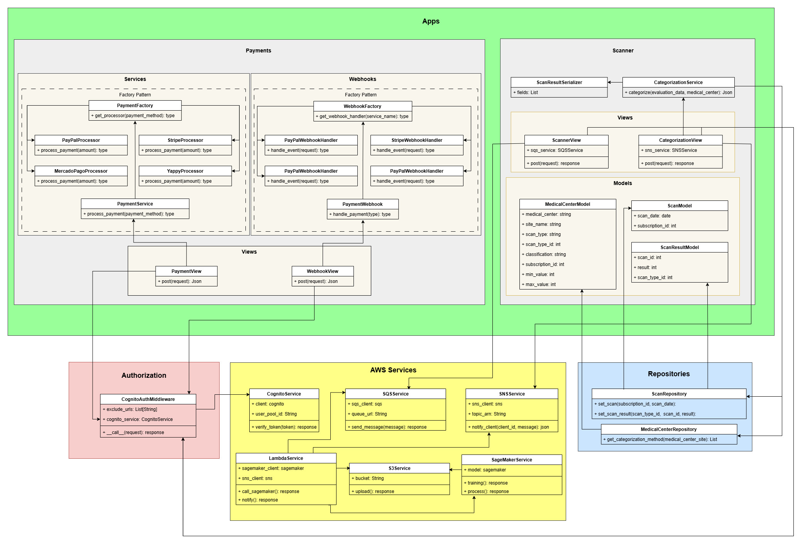

# Diagrama

# Capas

## Config

Contiene los archivos necesarios para funcionamiento de django, urls, settings...

En settings se definen las configuraciones para la conexión a la base de datos y AWS.

## AWS Services

Contiene los archivos .py para conectarse a los servicios de AWS
- SNS
- Cognito
- SQS

## Apps

Es la capa que contiene los servicios principales de la app

### Scanner

Contiene la lógica principal del scanner, tiene los endpoints necesarios para comunicarse con el cliente y servicios de terceros (AWS)
Tiene los modelos y vistas correspondientes

### Payments

Contiene la logica para las conexiones con los distintos metodos de pago
Tiene los servicios para realizar los pagos y los webhooks a los cuales se notifica la realización del pago

## Authorization

Capa encargada de validar el token del usuario y validar si tiene los permisos necesarios

## Repositories

Es la capa que se encarga de comunicarse con la base de datos y extraer la información requerida de las tablas
