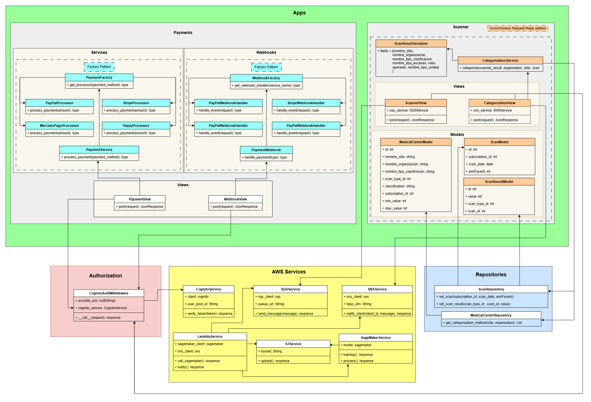

# Diagrama

# Capas

## Config

Contiene los archivos necesarios para funcionamiento de django, urls, settings...

En settings se definen las configuraciones para la conexión a la base de datos y AWS.

## AWS Services

Contiene los servicios de AWS que se utilizarán en el proyecto

## Apps

Es la capa que contiene los servicios principales de la app

### Scanner

Contiene la lógica principal del scanner, tiene los endpoints necesarios para comunicarse con el cliente y servicios de terceros (AWS).
Utiliza el patron asincronico request-response, recibe la solicitud por parte del cliente, le respondé que realizará el proceso y cuando está listo le comunica por sns
Tiene los modelos y serializadores para conectarse con la base de datos mediante un ORM y realizar las consultas correspondientes

#### Models

- MedicalCenterModel: Es el modelo de la vista que contiene la categorización de cada centro medico con sus respectivos parametros, valores y unidades
- ScanModel: Es el modelo del scaneo resultante
- ScanResultModel: Es el modelo de los resultados de los parametro del scaneo

#### Views 

- ScannerView: Es la vista que se encarga de recibir las solicitudes por parte del cliente para realizar el escaneo
- CategorizationView: Es la vista que se comunica con sagemaker para categorizar los resultados del escaneo

#### Categorization Service

Es el servicio que se encarga de categorizar los resultados, utiliza el repositorio de categorización para obtener los datos de categorización de cada centro medico

#### ScanResult Serializer

Serializa los datos extraidos de la base de la categorización

### Payments

Contiene la logica para las conexiones con los distintos metodos de pago
Tiene los servicios para realizar los pagos y los webhooks a los cuales se notifica la realización del pago
Utiliza un patron factory para la creación de los distintos metodos de pago

## Authorization

Capa encargada de verificar el token del usuario y validar si tiene los permisos necesarios para realizar las solicitudes al sistema

## Repositories

Es la capa que se encarga de comunicarse con la base de datos y extraer la información necesaria de las tablas

### ScanRepository
Se encarga de guardar los datos del scaneo en la base de datos
### MedicalCenterRepository
Se encarga de extraer los datos de categorización de cada centro medico para poder clasificar el resultado del escaneo
