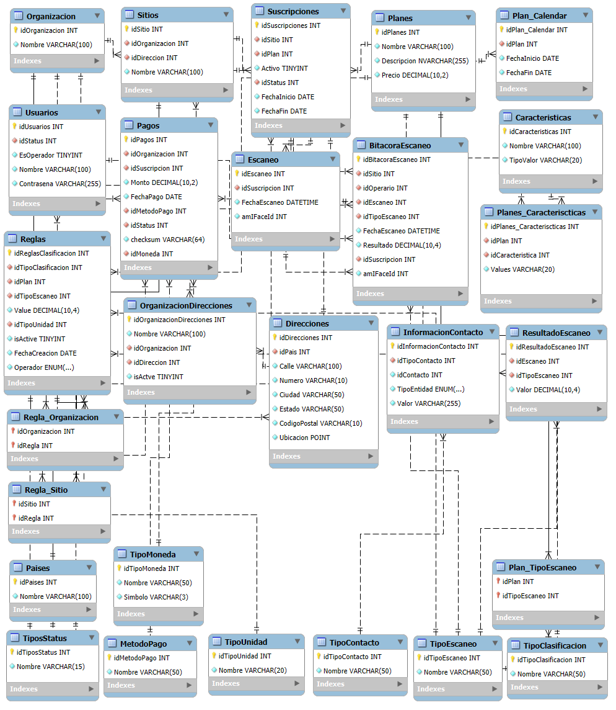

# Desarrollo de la base de datos

## Tabla de Contenidos

- [Diseño](#diseño)
- [ScriptBD](ScriptData.sql)
- [Llenado de Datos](DatosTablas.sql)
- [Ejemplo de Datos](#ejemplo)

## Diseño

Como primer paso, se procede a la realización del modelo de las tablas y sus relaciones haciendo uso de diagrama. A continuación se añade una imagen de cada una de las tablas generadas y sus relaciones:

## Script MySQL
Ahora, que se han mostrado las tablas y sus relaciones de manera visual, se adjunta link que direcciona al Script de creación de las tablas y relaciones:
[ScriptBD](ScriptData.sql)

## Datos

A continuación, se agrega el link que dirige al script de llenado de datos: [Llenado de Datos](DatosTablas.sql)

## Ejemplo

Se muestran los elementos que podrían contener cada una de las tablas, ignorando elementos como los FK:

    CREATE TABLE `Paises` (
    `idPaises` int NOT NULL AUTO_INCREMENT,                    --1
    `Nombre` varchar(100) NOT NULL,                            --Costa Rica
    PRIMARY KEY (`idPaises`)                              
    ) ENGINE=InnoDB AUTO_INCREMENT=1 DEFAULT CHARSET=utf8mb3;

    CREATE TABLE `Organizacion` (
    `idOrganizacion` int NOT NULL AUTO_INCREMENT,                --1
    `Nombre` varchar(100) NOT NULL,                              --Hospital Central
    PRIMARY KEY (`idOrganizacion`)
    ) ENGINE=InnoDB AUTO_INCREMENT=1 DEFAULT CHARSET=utf8mb3;

    CREATE TABLE `Direcciones` (
    `idDirecciones` int NOT NULL AUTO_INCREMENT,                --1
    `idPais` int NOT NULL,                                      --1
    `Calle` varchar(100) NOT NULL,                              --San Juan
    `Numero` varchar(10) NOT NULL,                              --A10
    `Ciudad` varchar(50) NOT NULL,                              --Cartago
    `Estado` varchar(50) NOT NULL,                              --Cartago
    `CodigoPostal` varchar(10) NOT NULL,                        --30106
    `Ubicacion` point NOT NULL,                                 --PONT(-11.11, 11.11)
    PRIMARY KEY (`idDirecciones`),
    KEY `Direcciones_idPais_idx` (`idPais`),
    CONSTRAINT `Direcciones_idPais` FOREIGN KEY (`idPais`) REFERENCES `Paises` (`idPaises`)
    ) ENGINE=InnoDB AUTO_INCREMENT=1 DEFAULT CHARSET=utf8mb3;

    CREATE TABLE `Organizaciondirecciones` (
    `idOrganizacionDirecciones` int NOT NULL AUTO_INCREMENT,                --1
    `Nombre` varchar(100) NOT NULL,                                         --Central Costa Rica
    `idOrganizacion` int NOT NULL,                                          --1
    `idDireccion` int NOT NULL,                                             --1
    `isActve` tinyint NOT NULL,                                             --TRUE
    PRIMARY KEY (`idOrganizacionDirecciones`),
    KEY `OrgDic_idOrganizacion_idx` (`idOrganizacion`),
    KEY `OrgDic_idDirecciones_idx` (`idDireccion`),
    CONSTRAINT `OrgDic_idDirecciones` FOREIGN KEY (`idDireccion`) REFERENCES `Direcciones` (`idDirecciones`),
    CONSTRAINT `OrgDic_idOrganizacion` FOREIGN KEY (`idOrganizacion`) REFERENCES `Organizacion` (`idOrganizacion`)
    ) ENGINE=InnoDB AUTO_INCREMENT=1 DEFAULT CHARSET=utf8mb3;

    CREATE TABLE `Sitios` (
    `idSitio` int NOT NULL AUTO_INCREMENT,                        --1
    `idOrganizacion` int NOT NULL,                                --1
    `idDireccion` int NOT NULL,                                   --2
    `Nombre` varchar(100) NOT NULL,                               --Hospital Central La Amistad
    PRIMARY KEY (`idSitio`),
    KEY `idOrganizacion_idx` (`idOrganizacion`),
    KEY `Sitio_idDireccion_idx` (`idDireccion`),
    CONSTRAINT `Sitio_idDireccion` FOREIGN KEY (`idDireccion`) REFERENCES `Direcciones` (`idDirecciones`),
    CONSTRAINT `Sitio_idOrganizacion` FOREIGN KEY (`idOrganizacion`) REFERENCES `Organizacion` (`idOrganizacion`)
    ) ENGINE=InnoDB AUTO_INCREMENT=1 DEFAULT CHARSET=utf8mb3;

    CREATE TABLE `Planes` (
    `idPlanes` int NOT NULL AUTO_INCREMENT,                        --1
    `Nombre` varchar(100) NOT NULL,                                --Plan Básico
    `Descripcion` varchar(255) CHARACTER SET utf8mb3 COLLATE utf8mb3_general_ci NOT NULL, --Descripción Plan Básico
    `Precio` decimal(10,2) NOT NULL,                                --1000
    PRIMARY KEY (`idPlanes`)
    ) ENGINE=InnoDB AUTO_INCREMENT=1 DEFAULT CHARSET=utf8mb3;

    CREATE TABLE `TipoClasificacion` (
    `idTipoClasificacion` int NOT NULL AUTO_INCREMENT,              --1
    `Nombre` varchar(50) NOT NULL,                                  --Rojo
    PRIMARY KEY (`idTipoClasificacion`)
    ) ENGINE=InnoDB AUTO_INCREMENT=1 DEFAULT CHARSET=utf8mb3;

    CREATE TABLE `TipoUnidad` (
    `idTipoUnidad` int NOT NULL AUTO_INCREMENT,                    --1
    `Nombre` varchar(20) NOT NULL,                                 --Centímetros
    PRIMARY KEY (`idTipoUnidad`)
    ) ENGINE=InnoDB AUTO_INCREMENT=1 DEFAULT CHARSET=utf8mb3;

    CREATE TABLE `TipoEscaneo` (
    `idTipoEscaneo` int NOT NULL AUTO_INCREMENT,                    --1
    `Nombre` varchar(50) NOT NULL,                                  --Altura
    PRIMARY KEY (`idTipoEscaneo`)
    ) ENGINE=InnoDB AUTO_INCREMENT=1 DEFAULT CHARSET=utf8mb3;

    CREATE TABLE `Caracteristicas` (
    `idCaracteristicas` int NOT NULL AUTO_INCREMENT,                --1
    `Nombre` varchar(100) NOT NULL,                                 --Disponibilidad
    `TipoValor` varchar(20) NOT NULL,                               --Entero
    PRIMARY KEY (`idCaracteristicas`)
    ) ENGINE=InnoDB AUTO_INCREMENT=1 DEFAULT CHARSET=utf8mb3;

    CREATE TABLE `TipoMoneda` (
    `idTipoMoneda` int NOT NULL AUTO_INCREMENT,                    --1
    `Nombre` varchar(50) NOT NULL,                                 --Dólares
    `Simbolo` varchar(3) NOT NULL,                                 --USD
    PRIMARY KEY (`idTipoMoneda`)
    ) ENGINE=InnoDB AUTO_INCREMENT=1 DEFAULT CHARSET=utf8mb3;

    CREATE TABLE `TiposStatus` (
    `idTiposStatus` int NOT NULL AUTO_INCREMENT,                    --1
    `Nombre` varchar(15) NOT NULL,                                  --Activo
    PRIMARY KEY (`idTiposStatus`)
    ) ENGINE=InnoDB AUTO_INCREMENT=1 DEFAULT CHARSET=utf8mb3;

    CREATE TABLE `TipoContacto` (
    `idTipoContacto` int NOT NULL AUTO_INCREMENT,                    --1
    `Nombre` varchar(50) NOT NULL,                                   --Celular
    PRIMARY KEY (`idTipoContacto`)
    ) ENGINE=InnoDB AUTO_INCREMENT=1 DEFAULT CHARSET=utf8mb3;

    CREATE TABLE `Usuarios` (
    `idUsuarios` int NOT NULL AUTO_INCREMENT,                       --1
    `idStatus` int NOT NULL,                                         --1
    `EsOperador` tinyint NOT NULL,                                   --TRUE
    `Nombre` varchar(100) NOT NULL,                                  --Juan Carlos
    `Contrasena` varchar(255) NOT NULL,                              --sjldwlakdn2u3jefnsandasdjkawk
    PRIMARY KEY (`idUsuarios`),   
    KEY `idStatus_idx` (`idStatus`),
    CONSTRAINT `Usuarios_idStatus` FOREIGN KEY (`idStatus`) REFERENCES `TiposStatus` (`idTiposStatus`)
    ) ENGINE=InnoDB AUTO_INCREMENT=1 DEFAULT CHARSET=utf8mb3;

    CREATE TABLE `Suscripciones` (
    `idSuscripciones` int NOT NULL AUTO_INCREMENT,                --1
    `idSitio` int NOT NULL,                                       --1
    `idPlan` int NOT NULL,                                        --1
    `Activo` tinyint NOT NULL,                                    --TRUE
    `idStatus` int NOT NULL,                                      --2
    `FechaInicio` date NOT NULL,                                  --18/10/2024
    `FechaFin` date NOT NULL,                                     --18/11/2024
    PRIMARY KEY (`idSuscripciones`),
    KEY `idPlan_idx` (`idPlan`),
    KEY `idSitio_idx` (`idSitio`),
    KEY `idStatus_idx` (`idStatus`),
    CONSTRAINT `Suscripciones_idPlan` FOREIGN KEY (`idPlan`) REFERENCES `Planes` (`idPlanes`),
    CONSTRAINT `Suscripciones_idSitio` FOREIGN KEY (`idSitio`) REFERENCES `Sitios` (`idSitio`),
    CONSTRAINT `Suscripciones_idStatus` FOREIGN KEY (`idStatus`) REFERENCES `TiposStatus` (`idTiposStatus`)
    ) ENGINE=InnoDB AUTO_INCREMENT=1 DEFAULT CHARSET=utf8mb3;

    CREATE TABLE `Plan_Calendar` (
    `idPlan_Calendar` int NOT NULL AUTO_INCREMENT,                --1
    `idPlan` int NOT NULL,                                        --1
    `FechaInicio` date NOT NULL,                                  --18/10/2024
    `FechaFin` date NOT NULL,                                     --18/11/2024
    PRIMARY KEY (`idPlan_Calendar`),
    KEY `Calendar_idPlanes_idx` (`idPlan`),
    CONSTRAINT `Calendar_idPlanes` FOREIGN KEY (`idPlan`) REFERENCES `Planes` (`idPlanes`)
    ) ENGINE=InnoDB AUTO_INCREMENT=1 DEFAULT CHARSET=utf8mb3;

    CREATE TABLE `Plan_TipoEscaneo` (
    `idPlan` int NOT NULL,                                    --1
    `idTipoEscaneo` int NOT NULL,                             --1
    PRIMARY KEY (`idPlan`,`idTipoEscaneo`),
    KEY `PlanTipoEscaneo_idTipoEscaneo_idx` (`idTipoEscaneo`),
    CONSTRAINT `PlanTipoEscaneo_idPlan` FOREIGN KEY (`idPlan`) REFERENCES `Planes` (`idPlanes`),
    CONSTRAINT `PlanTipoEscaneo_idTipoEscaneo` FOREIGN KEY (`idTipoEscaneo`) REFERENCES `TipoEscaneo` (`idTipoEscaneo`)
    ) ENGINE=InnoDB AUTO_INCREMENT=1 DEFAULT CHARSET=utf8mb3;

    CREATE TABLE `Planes_Caracteriscticas` (
    `idPlanes_Caracteriscticas` int NOT NULL AUTO_INCREMENT,        --1
    `idPlan` int NOT NULL,                                          --1
    `idCaracteristica` int NOT NULL,                                --1
    `Values` varchar(20) NOT NULL,                                  --1000
    PRIMARY KEY (`idPlanes_Caracteriscticas`),
    KEY `idPlanCaract_idPlan_idx` (`idPlan`),
    KEY `idPlanCaract_idCaract_idx` (`idCaracteristica`),
    CONSTRAINT `idPlanCaract_idCaract` FOREIGN KEY (`idCaracteristica`) REFERENCES `Caracteristicas` (`idCaracteristicas`),
    CONSTRAINT `idPlanCaract_idPlan` FOREIGN KEY (`idPlan`) REFERENCES `Planes` (`idPlanes`)
    ) ENGINE=InnoDB AUTO_INCREMENT=1 DEFAULT CHARSET=utf8mb3;

    CREATE TABLE `Reglas` (
    `idReglasClasificacion` int NOT NULL AUTO_INCREMENT,            --1
    `idTipoClasificacion` int NOT NULL,                             --1
    `idPlan` int NOT NULL,                                          --1
    `idTipoEscaneo` int NOT NULL,                                   --1
    `Value` decimal(10,4) NOT NULL,                                 --170
    `idTipoUnidad` int NOT NULL,                                    --1
    `isActive` tinyint NOT NULL,                                    --TRUE
    `FechaCreacion` date NOT NULL,                                  --18/04/2024
    `Operador` enum('<','>','=','>=','<=') NOT NULL,                --<
    PRIMARY KEY (`idReglasClasificacion`),
    KEY `idTipoClasificacion_idx` (`idTipoClasificacion`),
    KEY `idPlan_idx` (`idPlan`),
    KEY `idTipoEscaneo_idx` (`idTipoEscaneo`),
    KEY `Reglas_idTipoUnidad_idx` (`idTipoUnidad`),
    CONSTRAINT `Reglas_idPlan` FOREIGN KEY (`idPlan`) REFERENCES `Planes` (`idPlanes`),
    CONSTRAINT `Reglas_idTipoClasificacion` FOREIGN KEY (`idTipoClasificacion`) REFERENCES `TipoClasificacion` (`idTipoClasificacion`),
    CONSTRAINT `Reglas_idTipoEscaneo` FOREIGN KEY (`idTipoEscaneo`) REFERENCES `TipoEscaneo` (`idTipoEscaneo`),
    CONSTRAINT `Reglas_idTipoUnidad` FOREIGN KEY (`idTipoUnidad`) REFERENCES `TipoUnidad` (`idTipoUnidad`)
    ) ENGINE=InnoDB AUTO_INCREMENT=1 DEFAULT CHARSET=utf8mb3;

    CREATE TABLE `Regla_Organizacion` (
    `idOrganizacion` int NOT NULL,                    --1
    `idRegla` int NOT NULL,                           --1
    PRIMARY KEY (`idOrganizacion`,`idRegla`),
    KEY `idRegOrg_Regla_idx` (`idRegla`),
    CONSTRAINT `idRegOrg_Organizacion` FOREIGN KEY (`idOrganizacion`) REFERENCES `organizacion` (`idOrganizacion`),
    CONSTRAINT `idRegOrg_Regla` FOREIGN KEY (`idRegla`) REFERENCES `reglas` (`idReglasClasificacion`)
    ) ENGINE=InnoDB DEFAULT CHARSET=utf8mb3;

    CREATE TABLE `Regla_Sitio` (
    `idSitio` int NOT NULL,                        --1
    `idRegla` int NOT NULL,                        --2
    PRIMARY KEY (`idSitio`,`idRegla`),
    KEY `idRegSit_idRegla_idx` (`idRegla`),
    CONSTRAINT `idRegSit_idRegla` FOREIGN KEY (`idRegla`) REFERENCES `reglas` (`idReglasClasificacion`),
    CONSTRAINT `idRegSit_idSitio` FOREIGN KEY (`idSitio`) REFERENCES `sitios` (`idSitio`)
    ) ENGINE=InnoDB DEFAULT CHARSET=utf8mb3;

    CREATE TABLE `Escaneo` (
    `idEscaneo` int NOT NULL AUTO_INCREMENT,                --1
    `idSuscripcion` int NOT NULL,                           --1
    `FechaEscaneo` datetime NOT NULL,                       --19/10/2024
    `amIFaceId` int NOT NULL,                               --283812
    PRIMARY KEY (`idEscaneo`),
    KEY `idSuscripcion_idx` (`idSuscripcion`),
    CONSTRAINT `Escaneo_idSuscripcion` FOREIGN KEY (`idSuscripcion`) REFERENCES `Suscripciones` (`idSuscripciones`)
    ) ENGINE=InnoDB AUTO_INCREMENT=1 DEFAULT CHARSET=utf8mb3;

    CREATE TABLE `ResultadoEscaneo` (
    `idResultadoEscaneo` int NOT NULL AUTO_INCREMENT,        --1
    `idEscaneo` int NOT NULL,                                --1
    `idTipoEscaneo` int NOT NULL,                            --1
    `Valor` decimal(10,4) NOT NULL,                          --180
    PRIMARY KEY (`idResultadoEscaneo`),
    KEY `Resultado_idEscaneo_idx` (`idEscaneo`),
    KEY `Resultado_idTipoEscaneo_idx` (`idTipoEscaneo`),
    CONSTRAINT `Resultado_idEscaneo` FOREIGN KEY (`idEscaneo`) REFERENCES `Escaneo` (`idEscaneo`),
    CONSTRAINT `Resultado_idTipoEscaneo` FOREIGN KEY (`idTipoEscaneo`) REFERENCES `TipoEscaneo` (`idTipoEscaneo`)
    ) ENGINE=InnoDB AUTO_INCREMENT=1 DEFAULT CHARSET=utf8mb3;

    CREATE TABLE `BitacoraEscaneo` (
    `idBitacoraEscaneo` int NOT NULL AUTO_INCREMENT,            --1
    `idSitio` int NOT NULL,                                     --1
    `idOperario` int NOT NULL,                                  --1
    `idEscaneo` int NOT NULL,                                   --1
    `idTipoEscaneo` int NOT NULL,                               --1
    `FechaEscaneo` datetime NOT NULL,                           --19/10/2024
    `Resultado` decimal(10,4) NOT NULL,                         --190
    `idSuscripcion` int NOT NULL,                               --1
    `amIFaceId` int NOT NULL,                                   -1092382
    PRIMARY KEY (`idBitacoraEscaneo`),
    KEY `idSitio_idx` (`idSitio`),
    KEY `idOperario_idx` (`idOperario`),
    KEY `idEscaneo_idx` (`idEscaneo`),
    KEY `Bitacora_idTipoEscaneo_idx` (`idTipoEscaneo`),
    KEY `Bitacora_idSuscripcion_idx` (`idSuscripcion`),
    CONSTRAINT `Bitacora_idEscaneo` FOREIGN KEY (`idEscaneo`) REFERENCES `Escaneo` (`idEscaneo`),
    CONSTRAINT `Bitacora_idOperario` FOREIGN KEY (`idOperario`) REFERENCES `Usuarios` (`idOperarios`),
    CONSTRAINT `Bitacora_idSitio` FOREIGN KEY (`idSitio`) REFERENCES `Sitios` (`idSitio`),
    CONSTRAINT `Bitacora_idSuscripcion` FOREIGN KEY (`idSuscripcion`) REFERENCES `Suscripciones` (`idSuscripciones`),
    CONSTRAINT `Bitacora_idTipoEscaneo` FOREIGN KEY (`idTipoEscaneo`) REFERENCES `TipoEscaneo` (`idTipoEscaneo`)
    ) ENGINE=InnoDB AUTO_INCREMENT=1 DEFAULT CHARSET=utf8mb3;

    CREATE TABLE `InformacionContacto` (
    `idInformacionContacto` int NOT NULL AUTO_INCREMENT,        --1
    `idTipoContacto` int NOT NULL,                              --1
    `idContacto` int NOT NULL,                                  --1
    `TipoEntidad` enum('Organizacion','Operario') NOT NULL,     --Operario
    `Valor` varchar(255) NOT NULL,                              --1234-5678
    PRIMARY KEY (`idInformacionContacto`),
    KEY `InfoContac_idTipoContacto_idx` (`idTipoContacto`),
    CONSTRAINT `InfoContac_idTipoContacto` FOREIGN KEY (`idTipoContacto`) REFERENCES `tipocontacto` (`idTipoContacto`)
    ) ENGINE=InnoDB AUTO_INCREMENT=1 DEFAULT CHARSET=utf8mb3;

    CREATE TABLE `Metodopago` (
    `idMetodoPago` int NOT NULL AUTO_INCREMENT,                --1
    `Nombre` varchar(50) NOT NULL,                             --PayPal
    PRIMARY KEY (`idMetodoPago`)
    ) ENGINE=InnoDB AUTO_INCREMENT=1 DEFAULT CHARSET=utf8mb3;

    CREATE TABLE `Pagos` (
    `idPagos` int NOT NULL AUTO_INCREMENT,                       --1
    `idOrganizacion` int NOT NULL,                               --1
    `idSuscripcion` int NOT NULL,                                --1
    `Monto` decimal(10,2) NOT NULL,                              --100
    `FechaPago` date NOT NULL,                                   --30/04/2024
    `idMetodoPago` int NOT NULL,                                 --1
    `idStatus` int NOT NULL,                                     --2
    `checksum` varchar(64) NOT NULL,                             --8jdlcrc3nbicr3d73
    `idMoneda` int NOT NULL,                                     --1
    PRIMARY KEY (`idPagos`),
    KEY `idOrganizacion_idx` (`idOrganizacion`),
    KEY `idSuscripcion_idx` (`idSuscripcion`),
    KEY `idMetodoPago_idx` (`idMetodoPago`),
    KEY `idStatus_idx` (`idStatus`),
    CONSTRAINT `Pagos_idMetodoPago` FOREIGN KEY (`idMetodoPago`) REFERENCES `metodopago` (`idMetodoPago`),
    CONSTRAINT `Pagos_idOrganizacion` FOREIGN KEY (`idOrganizacion`) REFERENCES `organizacion` (`idOrganizacion`),
    CONSTRAINT `Pagos_idStatus` FOREIGN KEY (`idStatus`) REFERENCES `tiposstatus` (`idTiposStatus`),
    CONSTRAINT `Pagos_idSuscripcion` FOREIGN KEY (`idSuscripcion`) REFERENCES `suscripciones` (`idSuscripciones`)
    ) ENGINE=InnoDB AUTO_INCREMENT=1 DEFAULT CHARSET=utf8mb3;
