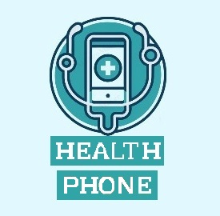
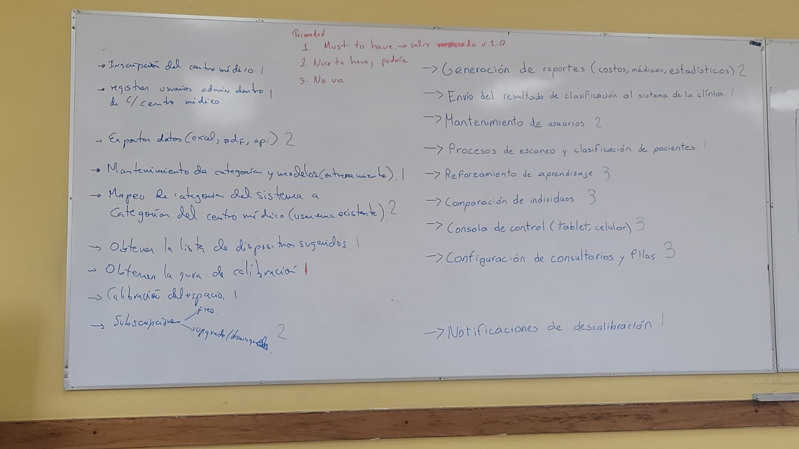
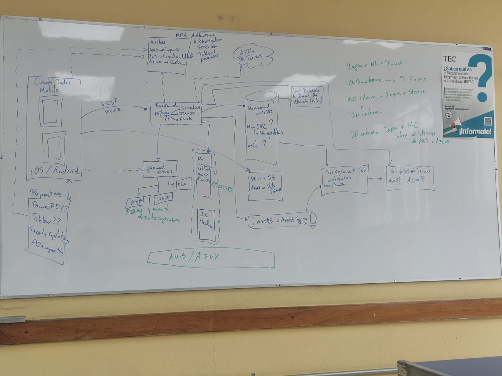
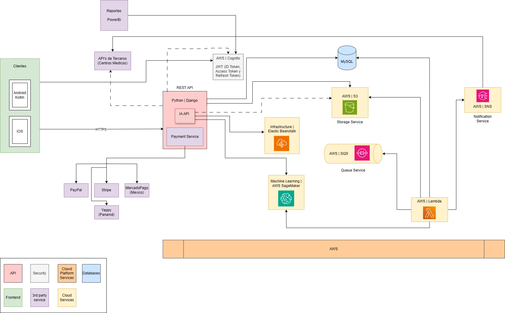

# Nombre del proyecto

## Health Phone

# Marca

# Descripción del proyecto

Diseño e implementación de una aplicación móvil en la que centros médicos y hospitales puedan tener acceso por medio de una suscripción. Esta aplicación realizará la tarea de una evaluación médica a los pacientes que ingresen al hospital o centro médico, dicha evaluación será aproximada más no precisa, las evaluaciones se obtendrán con ayuda de una inteligencia artificial (IA) y dispositivos especializados que permitan la medición de la presión, temperatura, signos vitales, etc... Entre estos dispositivos se encuentra un celular encargado de realizar las mediciones por medio de un escaneo con su cámara y una tablet que funcione como dispositivo informativo acerca de la evaluación (los dispositivos estarían colocados estrategicamente en la entrada). El accionar del sistema deberá de realizarlo un operario, el cual le brindará las intrucciones a los pacientes y accionará el dispositivo para que realice el escaneo, luego de realizar la evaluación les va a indicar por medio de la tablet la fila a la que se tienen que dirigir;o bien, se le entregará una ficha del turno que les toca para ser atendidos, esto con el fin de reducir los tiempos de espera en los centros médicos. La categorización de los pacientes variaría dependiendo del hospital, pero lo ideal es que se le de prioridad a las personas que más lo necesitan, dicha acción sería realizada por la IA.

# Lista de requerimientos

## Imagen con los requerimientos decididos durante la reunión:

## Requerimientos ordenados por prioridad 1, 2 y 3:

### Requerimientos de nivel 1

- Inscripción del centro médico.
- Registro de usuarios administradores dentro de cada centro médico.
- Mantenimiento de categoría y modelos (entrenamiento).
- Obtener lista de dispositivos sugeridos.
- Obtener la guía de calibración.
- Calibración del espacio.
- Envío del resultado de clasificación al sistema de la clínica.
- Procesos de escaneo y clasificación de pacientes.
- Notificaciones de descalibración.

### Requerimientos de nivel 2

- Exportación de datos (excel, pdf, api).
- Mapeo de categoría del sistema a categoría del centro médico.
- Suscripción, versiones iniciales y versiones premium.
- Generación de reportes (costos, médicos, estadísticas).
- Mantenimiento de usuarios.

### Requerimientos de nivel 3

- Reforzamiento de aprendizaje.
- Comparación de individuos.
- Consola de control (tablet, celular).
- Configuración de consultorios y filas. 

## Imagen del diseño de la arquitectura del sistema

Se añade el primer diseño de arquitectura realizado durante la sesión con el profesor:

A continuación, el modelo final de la arquitectura del sistema:

