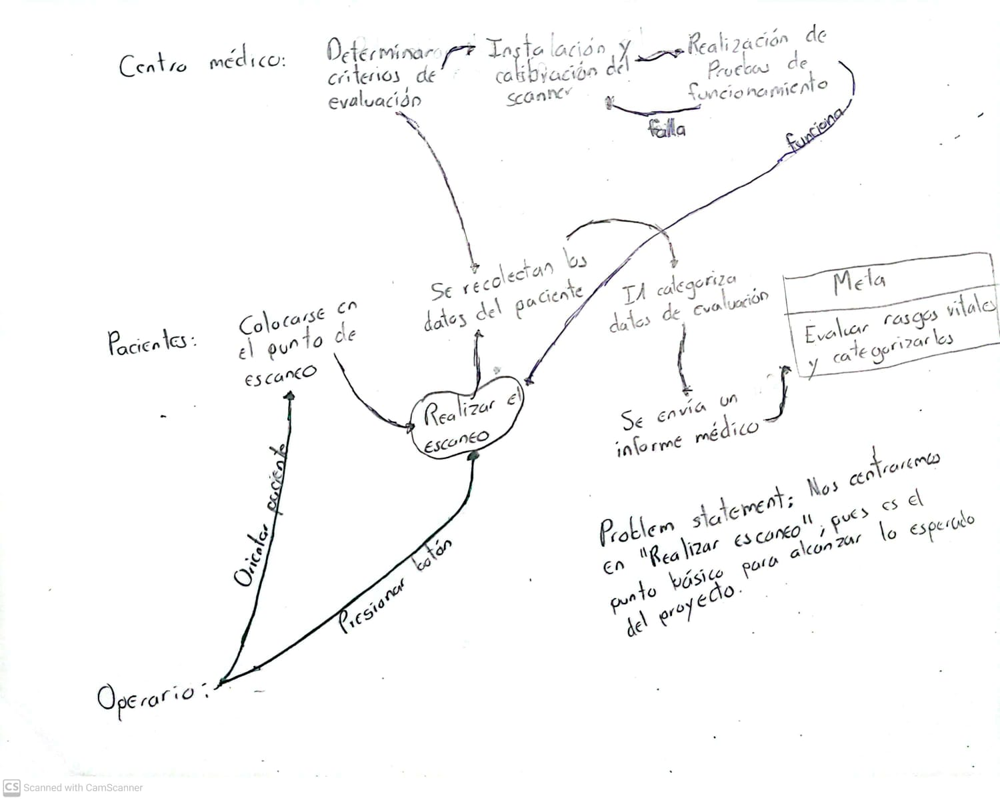

# Documento original

A continuación se adjunta el documento realizado en clase que se utilizó como guía para el desarrollo del Stage #3.

# Problema Statement:

Nos centraremos en "Realizar Escaneo", pues es el punto básico para alcanzar lo esperado del proyecto.

# Imagenes:

