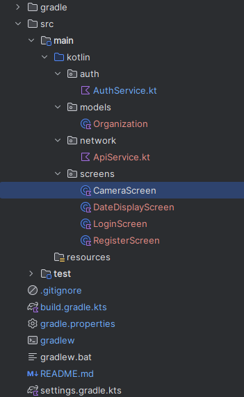

# Ideas implementadas

## Boilerplate
Trabajamos en un proyecto en Kotlin, usando el editor IntelliJ con Gradle.
Con base a ésto se genera la siguiente estructura del boilerplate.

* **gradle/**: Contiene archivos del wrapper de Gradle, como `gradle-wrapper.jar` y `gradle-wrapper.properties`, los
cuales permiten usar una versión específica de Gradle sin necesidad de instalarla globalmente en cada máquina.
* **src/**: Código fuente, contiene toda la información de ejecución del programa
* **.gitignore**: Archivo encargado de ignorar ciertas partes del proyecto, para evitar subir archivos innecesarios al repositorio.
* **build.gradle.kts**: Contiene la configuración build de Gradle, incluyendo las dependencias del programa.
* **settings.gradle.kts**: Especifica configuraciones del proyecto.
* **gradlew** y **gradlew.bat**: Scripts para ejecutar Gradle utilizando el wrapper, permitiendo que todos los desarrolladores
  utilicen la misma versión de Gradle. `gradlew` es para sistemas Unix (Linux/macOS) y `gradlew.bat` es para Windows.
* **gradle.properties**: Define propiedades para la construcción del proyecto, como configuraciones de la JVM.
* **src/main/kotlin**: Donde los archivos del programa se deben encontrar.
* **src/main/test**: Donde se ubican los archivos de pruebas del programa.

* **src/main/kotlin/auth**: Acá se colocan los archivos que tendrán la lógica de conexión con AWS Cognito
  - AuthService.kt
* **src/main/kotlin/models**: Acá se guardan las clases usadas durante el proyecto (Organización, Subscripcion, etc).
  - Organizacion
* **src/main/kotlin/network**: Acá se hace la conexión con llamadas, estilo SNS y Django, usando Ktor
  - ApiService.kt
* **src/main/kotlin/screens**: Contiene las pantallas o forma visual de las pantallas de distintos casos
  - LoginScreen
  - RegisterScreen
  - CameraScreen
  - DataDisplayScreen

