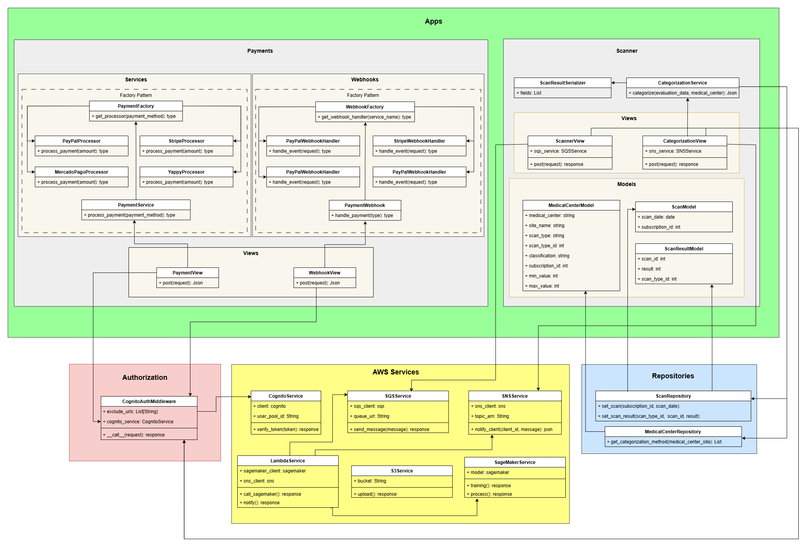

# Diagrama

# Config

Contiene los archivos necesarios para funcionamiento de django, urls, settings...

En settings se definen las configuraciones para la conexión a la base de datos y AWS.

# AWS Services

Contiene los archivos .py para conectarse a los servicios de AWS
- SageMaker
- Cognito
- S3

# Ia Scanner

Contiene la logica para realizar el proceso de scaneo, es la que se encarga de llamar a aws_services.sagemaker y obtener los videos de aws_services.s3

# Payments

Contiene la logica para las conexiones con los distintos metodos de pago

### Services

Se encargan de realizar los proceso de pago, verificar estados de pago, rembolsos...

### Webhooks

Se encargan de manejar las notificaciones que se reciben de los servicios de pago, como estado de una transacción o confirmacion de un pago

# Healthphone

Es la api que se encarga de subir los videos a S3 y cargar los datos de registro de organizaciones a MySQL
